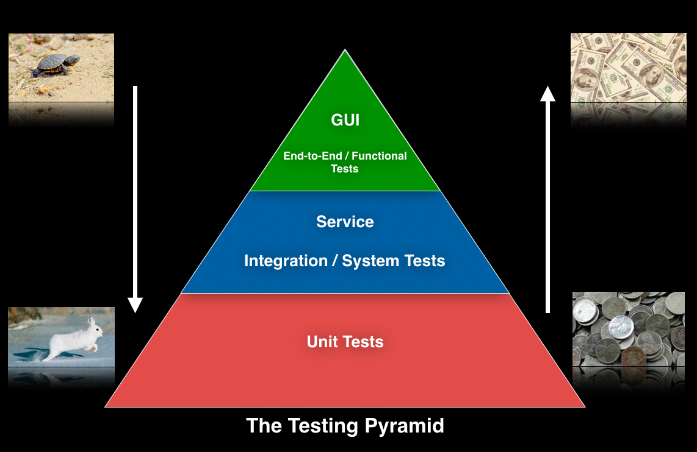

# Немного про тесты

Тесты - одна из самых зависимых частей ПО, т.к. они напрямую зависят от тестируемого компонента и косвенно от всех зависимостей этого компонента.

Отсюда вытекает следующее:

- Тесты могут быть хрупкими, чем больше зависимостей, тем более хрупкие тесты и этот показатель растет в сторону удаления от бизнес логики к интерфейсу
- Стоит минимизировать зависимость тестов от других компонентов ситемы
- Тесты на бизнес логику должны быть максимально независимыми и выполняться желательно с чистыми выходными данных, без необходимости подключения  БД, UI и других логических слоев приложения
- Чем более хрупкие тесты, тем они сложнее, дороже обходятся в поддержке и разработке и наоборот (по сути общее описание пирамиды тестирования)

