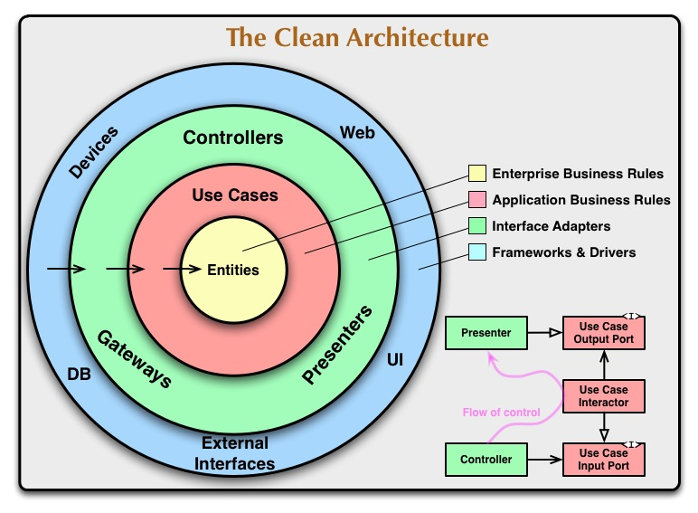

# Чистая архитектура

### Наконец-то эти заветные два слова

Все, что было описано выше по сути своей и формирует принципы построения чистой архитектуры, от принципов SOLID, до грамотного разделения границ компонентов и независимости от фреймворков

Общие характеристики суммарного подхода к архитектуре, объединяющего сформулированные принципы другими умными людьми (Гексагональная архитектура, DCI - Data-Context-Interaction, BCE - Boundary-Control-Entity):

- Независимость от фреймворка. Не зависит от наличия/отсутствия библиотеки. Фреймворк - просто инструмент. Нельзя строить архитектуру вокруг какого-то инструмента, инструмент должен лишь решать свои задачи. Если взять веб - приложение должно работать независимо от того, на React оно или на Vue
- Простота тестирования. Бизнес логика должна быть тестируема без наличия других компонентов, без конкретной БД, интерфейса и прочего, это сухие и строгие правила, по которым работает система, которые не зависят от внешних элементов. Внешние элементы должны зависеть от бизнес правил и быть легко заменяемыми
- Независимость от пользовательского интерфейса. От простого - можно заменить весь UiKit и это не повлияет на работу бизнес логики, до сложного - можно из десктопного приложения переехать в веб или мобильное, и это тоже никак не скажется на бизнес логике
- Независимость от способа предоставления данных. Мы отдаем наружу интерфейс, который должны реализовать на уровне данных, не важно какая за ним кроется БД, пусть даже это будет запись в текстовый файл
- Независимость от внешних агентов. Тут сложнее, на схеме это “external interfaces”, то есть все, что ведет за рамки системы/приложения, не должно влиять на бизнес логику

Если пройтись по схеме, то на ней четко видно:

- Где находятся границы логических уровней/копонентов
- Как направлены зависимости - от внешних к внутренним, от способа ввода/вывода к бизнес логике
- Где находятся самые стабильные компоненты - чем ближе к уровню бизнес логики
- Отсутствие цикличных зависимостей - направление строго в одну сторону, зависимость любого компонента можно проследить от начала и до конца
- Высокоуровневая логика не зависит от низкоуровневых компонентов
